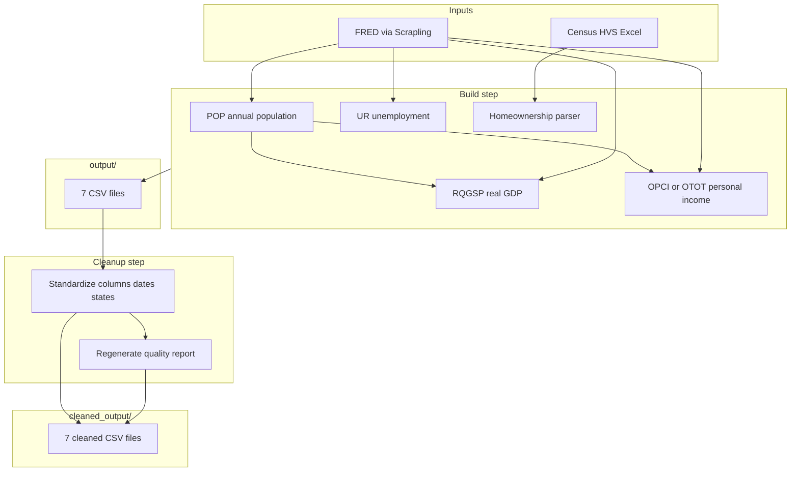

# State Economic Data Pipeline

This folder documents how `build_state_datasets_v1.py` builds state-level economic datasets, writes raw assembled files to `output/`, and produces professor-ready cleaned files in `cleaned_output/`.

## Quick start

From the `GDP/` directory:

```bash
python3 build_state_datasets.py
```

This runs the full pipeline:

1. **Build** — download/parse data and write CSVs to `output/`
2. **Quality check** — summarize `output/` in `output/data_quality_report.csv`
3. **Cleanup** — read `output/`, standardize, write to `cleaned_output/` (never overwrites `output/`)

To rerun cleanup only (no downloads):

```bash
python3 -c "from build_state_datasets import run_cleanup_step; run_cleanup_step()"
```

## Folder layout

```
GDP/
├── build_state_datasets_v1.py   # Main script
├── tab3_state05_2026_hmr.xlsx   # Census homeownership source (local)
├── List of States.xlsx          # State filter list (homeownership parser)
├── output/                      # Raw assembled CSVs from the build step
│   ├── *.csv
│   └── .fred_cache/             # Cached FRED CSV downloads (not cleaned)
├── cleaned_output/              # Standardized, submission-ready CSVs
│   └── *.csv
└── docs/
    └── README.md                # This file
```

**Use `cleaned_output/` for Stata, R, or submission.** Keep `output/` as the reproducible build artifact.

---

## Target panel

| Dimension | Coverage |
|-----------|----------|
| States | 27 (see list below) |
| Quarterly data | 2010Q1 – 2025Q4 (64 quarters × 27 states = **1,728 rows**) |
| Monthly unemployment | 2010M1 – 2025M12 (192 months × 27 states = **5,184 rows**) |

### Target states

| Abbr | State | Abbr | State | Abbr | State |
|------|-------|------|-------|------|-------|
| AR | Arkansas | IL | Illinois | NH | New Hampshire |
| AZ | Arizona | MA | Massachusetts | NJ | New Jersey |
| CA | California | MD | Maryland | NM | New Mexico |
| CO | Colorado | ME | Maine | NY | New York |
| CT | Connecticut | MN | Minnesota | OH | Ohio |
| DC | District of Columbia | OR | Oregon | PA | Pennsylvania |
| DE | Delaware | RI | Rhode Island | TX | Texas |
| FL | Florida | UT | Utah | VA | Virginia |
| | | VT | Vermont | WA | Washington |
| | | WI | Wisconsin | | |

---

## How `build_state_datasets_v1.py` works

The script has three major phases: **fetch & build**, **save to `output/`**, and **cleanup to `cleaned_output/`**.



### HTTP downloads (Scrapling + FRED)

Plain Python `requests` often times out or gets blocked by FRED’s Akamai protection. The script uses **Scrapling** (`FetcherSession` with Chrome impersonation via `curl_cffi`) to download FRED graph CSVs:

```
https://fred.stlouisfed.org/graph/fredgraph.csv?id={SERIES}&cosd=2010-01-01
```

Successful downloads are cached under `output/.fred_cache/{SERIES}.csv` so reruns are fast.

Optional: set `FRED_API_KEY` for API fallback on failed CSV downloads. Set `FRED_PAUSE=0` to disable pacing between requests.

### Build steps (in order)

#### 1. Population (`{ABBR}POP`)

- FRED series: e.g. `ARPOP`, `CAPOP`, …
- Annual state population in **thousands**
- Converted to persons (`× 1000`), one value per state-year
- Forward-filled within each state when a year is missing

Used as the denominator for real GDP per capita and for personal income where OPCI is unavailable.

#### 2. Real GDP per capita (`build_real_gdp_per_capita`)

- FRED series: `{ABBR}RQGSP` — real GDP in **millions of chained 2017 dollars** (SAAR)
- Formula:

  ```
  real_gdp_per_capita = real_gdp_millions × 1,000,000 / population
  ```

- Output is quarterly, trimmed to 2010Q1–2025Q4

#### 3. Personal income per capita (`build_personal_income_per_capita`)

- **Primary:** FRED `{ABBR}OPCI` (quarterly per capita, current dollars SAAR)
  - Only **Arkansas (AR)** and **Illinois (IL)** have OPCI on FRED
- **Fallback (25 states):** `{ABBR}OTOT` (total personal income, millions SAAR) ÷ annual population

#### 4. Unemployment (`build_unemployment`)

- FRED series: `{ABBR}UR` — BLS LAUS statewide unemployment rate (%), seasonally adjusted, monthly
- **Monthly file:** one row per state-month (2010M1–2025M12)
- **Quarterly file:** arithmetic mean of the three monthly rates in each quarter; **complete quarters only** (all 3 months must be present)

**October 2025 note:** FRED returns a blank value for 2025M10 for all 27 states. The script fills that gap by **linear interpolation** between September and November 2025 so the panel stays complete and 2025Q4 can be computed.

#### 5. Homeownership (`build_homeownership`)

- **No API** — parses local Census HVS file `tab3_state05_2026_hmr.xlsx`
- Uses `filter_homeownership_to_tidy.parse_homeownership()`
- Quarterly homeownership rate (%), not seasonally adjusted
- 2026Q1 from the source file is excluded; panel ends at 2025Q4

#### 6. Metadata

- `source_notes.csv` — documentation of each variable’s source, units, and method
- `data_quality_report.csv` — row counts, date ranges, missing values, duplicates (for `output/`)

All five data CSVs are saved to `output/`.

---

## From `output/` to `cleaned_output/`

The **cleanup step** (`run_cleanup_step()`) runs automatically at the end of `main()`. It:

- **Reads** from `output/` only
- **Writes** to `cleaned_output/` only (safe to rerun; never touches `output/`)
- **Regenerates** `cleaned_output/data_quality_report.csv` from the cleaned files (does not copy the old report)

### What cleanup does to each data file

1. Column names → lowercase `snake_case`
2. Columns reordered to a fixed schema (see below)
3. `state` = full name, `state_abbr` = 2-letter code (from `STATE_MAP`)
4. Strip whitespace from strings
5. `year`, `quarter`, `month` as integers
6. `date` as ISO `YYYY-MM-DD` (quarter-end or month-end)
7. Numeric value columns coerced; **missing values left blank** in the CSV
8. Sort by `state_abbr`, then `year`, then `quarter` or `month`
9. Drop duplicates on `(state_abbr, date)`
10. Keep only the 27 target states
11. Trim to panel range (2010–2025)
12. Remove stray index columns (`Unnamed: 0`, etc.)

A file gets **`status = ok`** in the quality report only if it has all 27 states, zero duplicate state-date rows, no extra states, and the expected row count.

---

## Files in `cleaned_output/`

### Data files (use these for analysis)

#### `real_gdp_per_capita_by_state.csv`

| | |
|---|---|
| **Rows** | 1,728 (27 × 64 quarters) |
| **Frequency** | Quarterly |
| **Date range** | 2010-03-31 → 2025-12-31 |
| **Source** | BEA via FRED (`{ABBR}RQGSP`, `{ABBR}POP`) |

**Columns (in order):**

| Column | Description |
|--------|-------------|
| `state` | Full state name |
| `state_abbr` | Two-letter abbreviation |
| `year` | Calendar year |
| `quarter` | Quarter (1–4) |
| `date` | Quarter-end date (`YYYY-MM-DD`) |
| `real_gdp_per_capita` | Real GDP per person (chained 2017 dollars) |
| `real_gdp_millions_chained_2017_dollars` | Numerator: state real GDP (millions, SAAR) |
| `population` | Denominator: annual population (persons) |

**Example row (Arkansas, 2010Q1):**

```
Arkansas,AR,2010,1,2010-03-31,37711.94,110194.2,2921998.0
```

---

#### `personal_income_per_capita_by_state.csv`

| | |
|---|---|
| **Rows** | 1,728 |
| **Frequency** | Quarterly |
| **Date range** | 2010-03-31 → 2025-12-31 |
| **Source** | BEA via FRED (`{ABBR}OPCI` or `{ABBR}OTOT` + `{ABBR}POP`) |

**Columns:**

| Column | Description |
|--------|-------------|
| `state` | Full state name |
| `state_abbr` | Two-letter abbreviation |
| `year` | Calendar year |
| `quarter` | Quarter (1–4) |
| `date` | Quarter-end date |
| `personal_income_per_capita` | Personal income per person (current dollars, SAAR) |

AR and IL use direct OPCI; all other states use OTOT ÷ population.

---

#### `monthly_unemployment_rate_by_state.csv`

| | |
|---|---|
| **Rows** | 5,184 (27 × 192 months) |
| **Frequency** | Monthly |
| **Date range** | 2010-01-31 → 2025-12-31 |
| **Source** | BLS LAUS via FRED (`{ABBR}UR`) |

**Columns:**

| Column | Description |
|--------|-------------|
| `state` | Full state name |
| `state_abbr` | Two-letter abbreviation |
| `year` | Calendar year |
| `month` | Month (1–12) |
| `date` | Month-end date |
| `unemployment_rate` | Unemployment rate (percent, seasonally adjusted) |

2025M10 values were interpolated where FRED published a blank.

---

#### `unemployment_rate_by_state.csv`

| | |
|---|---|
| **Rows** | 1,728 (27 × 64 quarters) |
| **Frequency** | Quarterly (mean of monthly rates) |
| **Date range** | 2010-03-31 → 2025-12-31 |
| **Source** | Derived from monthly `{ABBR}UR` |

**Columns:**

| Column | Description |
|--------|-------------|
| `state` | Full state name |
| `state_abbr` | Two-letter abbreviation |
| `year` | Calendar year |
| `quarter` | Quarter (1–4) |
| `date` | Quarter-end date |
| `unemployment_rate` | Mean of three monthly unemployment rates in the quarter |

Only **complete quarters** (three months present) are included. Includes 2025Q4 using interpolated October 2025.

---

#### `homeownership_rate_by_state.csv`

| | |
|---|---|
| **Rows** | 1,728 |
| **Frequency** | Quarterly |
| **Date range** | 2010-03-31 → 2025-12-31 |
| **Source** | Census HVS Table 3 (`tab3_state05_2026_hmr.xlsx`) |

**Columns:**

| Column | Description |
|--------|-------------|
| `state` | Full state name |
| `state_abbr` | Two-letter abbreviation |
| `year` | Calendar year |
| `quarter` | Quarter (1–4) |
| `date` | Quarter-end date |
| `homeownership_rate` | Homeownership rate (% of occupied units, not seasonally adjusted) |

---

### Documentation files

#### `source_notes.csv`

One row per variable. Documents where each dataset came from, frequency, seasonal adjustment, units, date range, output filename, and methodological notes (including OPCI fallback, unemployment interpolation, etc.).

**Columns:** `variable`, `source`, `frequency`, `seasonal_adjustment`, `units`, `date_range`, `output_file`, `notes`

---

#### `data_quality_report.csv`

Regenerated **after** cleaning. One row per data file with validation results.

**Columns:**

| Column | Meaning |
|--------|---------|
| `file` | CSV filename |
| `rows` | Row count |
| `unique_states` | Number of distinct `state_abbr` values |
| `min_date` / `max_date` | Observed date range |
| `missing_values` | Count of blank values in the main numeric column |
| `duplicate_state_date_rows` | Should be 0 |
| `all_27_states_present` | `True` if exactly the target 27 states appear |
| `missing_states` | Comma-separated list of absent target states (empty if none) |
| `extra_states` | Non-target states found (empty if none) |
| `status` | `ok` if all major checks pass; otherwise `review` |

**Current cleaned panel (all `ok`):**

| File | Rows | States | Missing values |
|------|------|--------|----------------|
| `real_gdp_per_capita_by_state.csv` | 1,728 | 27 | 0 |
| `personal_income_per_capita_by_state.csv` | 1,728 | 27 | 0 |
| `monthly_unemployment_rate_by_state.csv` | 5,184 | 27 | 0 |
| `unemployment_rate_by_state.csv` | 1,728 | 27 | 0 |
| `homeownership_rate_by_state.csv` | 1,728 | 27 | 0 |

---

## Importing into Stata or R

All cleaned files share a consistent long format:

- Identifiers: `state`, `state_abbr`
- Time: `year` + (`quarter` or `month`) + `date`
- One numeric outcome column per file

**Stata example:**

```stata
import delimited "cleaned_output/real_gdp_per_capita_by_state.csv", clear
encode state_abbr, gen(state_id)
xtset state_id date
```

**R example:**

```r
library(readr)
gdp <- read_csv("cleaned_output/real_gdp_per_capita_by_state.csv")
gdp$date <- as.Date(gdp$date)
```

---

## `output/` vs `cleaned_output/`

| | `output/` | `cleaned_output/` |
|---|-----------|-------------------|
| **Purpose** | Raw build artifact | Submission / analysis |
| **Written by** | Dataset builders | Cleanup step |
| **Column order** | May vary | Fixed, documented order |
| **Quality report** | Built from raw files | Regenerated after cleaning |
| **Overwritten by cleanup?** | No | Yes (files inside folder only) |

Both folders contain the same seven filenames; **`cleaned_output/` is the version to share with your professor.**

---

## Related files

- `DATA_SOURCES.md` — older notes comparing `build_state_datasets.py` (BLS API + BEA zip) vs v1 (FRED-only)
- `filter_homeownership_to_tidy.py` — Excel parser for Census homeownership tables
