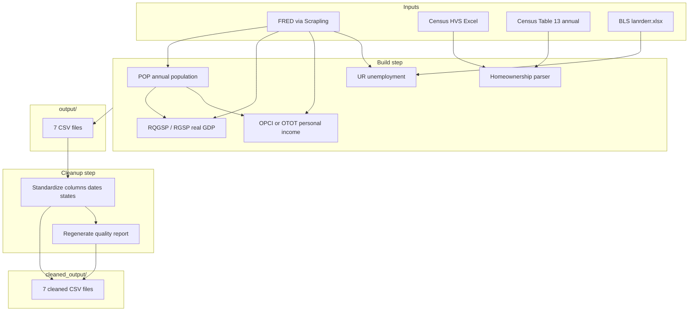

# State Economic Data Pipeline

This folder documents how `build_state_datasets.py` builds state-level economic datasets, writes raw assembled files to `output/`, and produces cleaned files in `cleaned_output/`.

The script supports three panel configurations: the original **2010–2025** panel, an extended **2001–2025** panel (quarterly sources only where available), and a **2001–2025 full panel** that backfills 2001–2004 from annual sources.

## Quick start

From this repository root:

```bash
# Default: build 2010 panel + extended 2001 panel
python3 build_state_datasets.py

# 2010–2025 panel only (output/ + cleaned_output/)
python3 build_state_datasets.py --standard

# 2001–2025 partial panel (GDP/home from quarterly sources only)
python3 build_state_datasets.py --extended

# 2001–2025 full panel — recommended for analysis (annual backfill 2001–2004)
python3 build_state_datasets.py --full-panel
```

Each run:

1. **Build** — download/parse data and write CSVs to the panel’s `output/` folder
2. **Quality check** — summarize raw files in `data_quality_report.csv`
3. **Cleanup** — read raw output, standardize, write to the panel’s `cleaned_output/` folder

To rerun cleanup only (no downloads):

```bash
python3 -c "from build_state_datasets import run_cleanup_step, PANEL_2001_FULL; run_cleanup_step(PANEL_2001_FULL)"
```

## Folder layout

```
.
├── build_state_datasets.py           # Main script
├── filter_homeownership_to_tidy.py   # Census homeownership parser
├── tab3_state05_2026_hmr.xlsx        # Census HVS quarterly Table 3 (local)
├── List of States.xlsx               # State filter list (homeownership parser)
├── census_hvs_annual_cache/          # Cached Census Table 13 annual files (2001–2005)
│
├── output/                           # 2010 panel — raw build
├── cleaned_output/                   # 2010 panel — cleaned (1,728 quarterly rows)
│
├── output_2001_2025/                 # Extended 2001 panel — raw build
├── cleaned_output_2001_2025/         # Extended 2001 panel — cleaned (partial early years)
│
├── output_2001_2025_full_panel/      # Full 2001 panel — raw build
├── cleaned_output_2001_2025_full_panel/  # Full 2001 panel — cleaned (2,700 quarterly rows)
│
└── docs/
    └── README.md                     # This file
```

**Use `cleaned_output_2001_2025_full_panel/` for the complete 2001Q1–2025Q4 analysis panel.**  
Use `cleaned_output/` if you only need 2010 onward and want to preserve the original submission folder unchanged.

FRED download caches live under `output/.fred_cache/` and `output_2001_2025/.fred_cache/` (not copied to cleaned folders).

---

## Target panel

| Dimension | 2010 panel | Full 2001 panel |
|-----------|------------|-----------------|
| States | 27 | 27 |
| Quarterly rows | 1,728 (64 × 27) | **2,700 (100 × 27)** |
| Monthly unemployment | 5,184 (192 × 27) | **8,100 (300 × 27)** |
| Date range | 2010Q1 – 2025Q4 | **2001Q1 – 2025Q4** |

### Target states

| Abbr | State | Abbr | State | Abbr | State |
|------|-------|------|-------|------|-------|
| AR | Arkansas | IL | Illinois | NH | New Hampshire |
| AZ | Arizona | MA | Massachusetts | NJ | New Jersey |
| CA | California | MD | Maryland | NM | New Mexico |
| CO | Colorado | ME | Maine | NY | New York |
| CT | Connecticut | MN | Minnesota | OH | Ohio |
| DC | District of Columbia | OR | Oregon | PA | Pennsylvania |
| DE | Delaware | RI | Rhode Island | TX | Texas |
| FL | Florida | UT | Utah | VA | Virginia |
| | | VT | Vermont | WA | Washington |
| | | WI | Wisconsin | | |

---

## Full panel methodology (2001–2004 backfill)

The `--full-panel` mode stitches annual and quarterly sources so every series covers 2001Q1–2025Q4.

| Series | 2001–2004 | 2005+ |
|--------|-----------|-------|
| Real GDP per capita | Annual FRED `{ABBR}RGSP` ÷ `{ABBR}POP`; same value assigned to Q1–Q4 | Quarterly FRED `{ABBR}RQGSP` ÷ `{ABBR}POP` |
| Personal income per capita | Full quarterly FRED `{ABBR}OTOT` or `{ABBR}OPCI` (AR, IL hybrid) | Same |
| Unemployment | Monthly FRED `{ABBR}UR`; quarterly = mean of 3 months | Same |
| Homeownership | Census HVS **Table 13** annual rate assigned to Q1–Q4 | 2005: annual Table 13 bridge; **2006Q1+**: quarterly Table 3 from local xlsx |

Census Table 13 files are downloaded once into `census_hvs_annual_cache/` from  
`https://www.census.gov/housing/hvs/files/annual{yy}/ann{yy}t13.txt`.

---

## How `build_state_datasets.py` works

The script has three major phases: **fetch & build**, **save to `output/`**, and **cleanup to `cleaned_output/`**.



### HTTP downloads (Scrapling + FRED)

Plain Python `requests` often times out or gets blocked by FRED’s Akamai protection. The script uses **Scrapling** (`FetcherSession` with Chrome impersonation via `curl_cffi`) to download FRED graph CSVs:

```
https://fred.stlouisfed.org/graph/fredgraph.csv?id={SERIES}&cosd=2001-01-01
```

Successful FRED downloads are cached under the panel’s `.fred_cache/` directory. BLS unemployment MOE reference file `lanrderr.xlsx` is cached alongside FRED series. Reruns are fast when cache hits.

Optional: set `FRED_API_KEY` for API fallback on failed CSV downloads. Set `FRED_PAUSE=0` to disable pacing between requests.

### Build steps (in order)

#### 1. Population (`{ABBR}POP`)

- FRED series: e.g. `ARPOP`, `CAPOP`, …
- Annual state population in **thousands**
- Converted to persons (`× 1000`), one value per state-year
- Forward-filled within each state when a year is missing

Used as the denominator for real GDP per capita and for personal income where OPCI is unavailable.

#### 2. Real GDP per capita (`build_real_gdp_per_capita`)

- **Full panel 2001–2004:** FRED `{ABBR}RGSP` (annual real GDP, millions chained 2017 dollars) ÷ annual population; assigned to all four quarters
- **2005+:** FRED `{ABBR}RQGSP` (quarterly real GDP, SAAR)
- Formula:

  ```
  real_gdp_per_capita = real_gdp_millions × 1,000,000 / population
  ```

#### 3. Personal income per capita (`build_personal_income_per_capita`)

- **Primary:** FRED `{ABBR}OPCI` (quarterly per capita, current dollars SAAR)
  - Only **Arkansas (AR)** and **Illinois (IL)** have OPCI on FRED
- **Fallback (25 states):** `{ABBR}OTOT` (total personal income, millions SAAR) ÷ annual population
- Full 2001–2025 coverage via OTOT/OPCI (no annual backfill needed)

#### 4. Unemployment (`build_unemployment`)

- FRED series: `{ABBR}UR` — BLS LAUS statewide unemployment rate (%), seasonally adjusted, monthly
- **Monthly file:** one row per state-month
- **Quarterly file:** arithmetic mean of the three monthly rates in each quarter; **complete quarters only**

**October 2025 note:** FRED returns a blank value for 2025M10 for all 27 states. The script fills that gap by **linear interpolation** between September and November 2025.

**Margin of error (unemployment):** BLS [Regional and State Employment and Unemployment — Model-based Error](https://www.bls.gov/web/laus/lanrderr.xlsx) (`lanrderr.xlsx`). Quarterly MOE is the **mean of the three monthly MOEs** in each quarter.

#### 5. Homeownership (`build_homeownership`)

- **2001–2005 (full panel):** Census HVS Table 13 annual rates, assigned to quarters
- **2006Q1–2025Q4:** local Census HVS file `tab3_state05_2026_hmr.xlsx` via `filter_homeownership_to_tidy.parse_homeownership()`
- **Margin of error:** Census-published MOE from Table 3 for quarterly rows; blank for annual-assigned rows

#### 6. Margin of error policy

| Dataset | `margin_of_error` column? | Notes |
|---------|---------------------------|-------|
| `homeownership_rate_by_state.csv` | Yes | Census MOE where available |
| `monthly_unemployment_rate_by_state.csv` | Yes | BLS-scaled MOE |
| `unemployment_rate_by_state.csv` | Yes | Mean of monthly MOEs |
| `real_gdp_per_capita_by_state.csv` | **No** | BEA does not publish sampling MOE for state GDP |
| `personal_income_per_capita_by_state.csv` | **No** | BEA does not publish sampling MOE for state personal income |

#### 7. Metadata

- `source_notes.csv` — source, units, and methodology for each variable
- `data_quality_report.csv` — row counts, date ranges, validation status

---

## Files in `cleaned_output_2001_2025_full_panel/`

### Data files (use these for analysis)

#### `real_gdp_per_capita_by_state.csv`

| | |
|---|---|
| **Rows** | 2,700 (27 × 100 quarters) |
| **Frequency** | Quarterly |
| **Date range** | 2001-03-31 → 2025-12-31 |
| **Source** | BEA via FRED (`{ABBR}RGSP` + `{ABBR}RQGSP`, `{ABBR}POP`) |

**Columns (in order):**

| Column | Description |
|--------|-------------|
| `state` | Full state name |
| `state_abbr` | Two-letter abbreviation |
| `year` | Calendar year |
| `quarter` | Quarter (1–4) |
| `date` | Quarter-end date (`YYYY-MM-DD`) |
| `real_gdp_per_capita` | Real GDP per person (chained 2017 dollars) |
| `real_gdp_millions_chained_2017_dollars` | State real GDP (millions, SAAR) |
| `population` | Annual population (persons) |

---

#### `personal_income_per_capita_by_state.csv`

| | |
|---|---|
| **Rows** | 2,700 |
| **Frequency** | Quarterly |
| **Date range** | 2001-03-31 → 2025-12-31 |
| **Source** | BEA via FRED (`{ABBR}OPCI` or `{ABBR}OTOT` + `{ABBR}POP`) |

**Columns:** `state`, `state_abbr`, `year`, `quarter`, `date`, `personal_income_per_capita`

AR and IL use direct OPCI where available; all other states use OTOT ÷ population.

---

#### `monthly_unemployment_rate_by_state.csv`

| | |
|---|---|
| **Rows** | 8,100 (27 × 300 months) |
| **Frequency** | Monthly |
| **Date range** | 2001-01-31 → 2025-12-31 |
| **Source** | BLS LAUS via FRED (`{ABBR}UR`) |

**Columns:** `state`, `state_abbr`, `year`, `month`, `date`, `unemployment_rate`, `margin_of_error`

---

#### `unemployment_rate_by_state.csv`

| | |
|---|---|
| **Rows** | 2,700 |
| **Frequency** | Quarterly (mean of monthly rates) |
| **Date range** | 2001-03-31 → 2025-12-31 |

**Columns:** `state`, `state_abbr`, `year`, `quarter`, `date`, `unemployment_rate`, `margin_of_error`

---

#### `homeownership_rate_by_state.csv`

| | |
|---|---|
| **Rows** | 2,700 |
| **Frequency** | Quarterly |
| **Date range** | 2001-03-31 → 2025-12-31 |
| **Source** | Census HVS Table 13 (2001–2005) + Table 3 xlsx (2006+) |

**Columns:** `state`, `state_abbr`, `year`, `quarter`, `date`, `homeownership_rate`, `margin_of_error`

---

### Documentation files

#### `source_notes.csv`

One row per variable with source, frequency, units, date range, output filename, and notes (including annual→quarterly assignment for GDP and homeownership).

#### `data_quality_report.csv`

Regenerated after cleaning. All five data files should show `status = ok` with 27 states, zero duplicates, and expected row counts.

**Current full panel (all `ok`):**

| File | Rows | States |
|------|------|--------|
| `real_gdp_per_capita_by_state.csv` | 2,700 | 27 |
| `personal_income_per_capita_by_state.csv` | 2,700 | 27 |
| `monthly_unemployment_rate_by_state.csv` | 8,100 | 27 |
| `unemployment_rate_by_state.csv` | 2,700 | 27 |
| `homeownership_rate_by_state.csv` | 2,700 | 27 |

---

## 2010 panel (`cleaned_output/`)

The original 2010–2025 panel remains in `cleaned_output/` (1,728 quarterly rows per series). Run `python3 build_state_datasets.py --standard` to rebuild it without touching the full 2001 panel folders.

Column schemas match the full panel except for date range and row counts. GDP and personal income files in the 2010 panel also omit `margin_of_error`.
